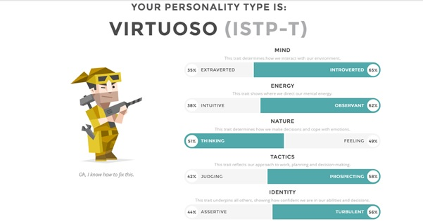
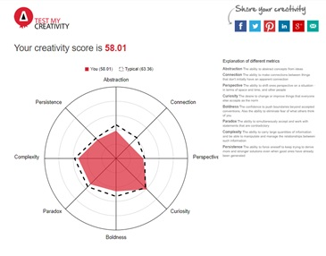

<html>
<h1>My profile</h1>

<body><h3>Personal info</h3> 

Name : Abdul Wahab shaikh

student number: 3790834

email address : s3790834@student.rmit.edu.au

<h4>basic background, nationality and culture
</h4>

I was born in Sydney, Australia in 1994 which makes me 24 years of age my father is of Pakistani heritage and my mother is Fijian descent. I have one younger brother and older sister so I grew up with 2 sibling and me being the middle child. I attended dalmany public school then attended Liverpool boys high school. 

<h4>Languages spoken 
</h4>

1) English  (mother tongue)

2) Urdu 

<h4>Interest and hobbies and favorite pastime 
</h4>

My interest includes working out at the gym going for long drives and learning something new regarding anything beneficial. love watching horror films as well as documentaries. my weakness is a good cooked meal and a interesting movie.my favorite past time is cruising in a luxury car far from the city enjoying the natural scenes.

<h4>pet favorite 
</h4>
Well personally I am a cat person and my favorite pet was a cat which I had in my teenage years named Momo. She was my companion she was always waiting for me when I came back from school. She disappeared on my final year of high school I was so devasted. 
</body>

<h3> My in interestIT ?</h3> 

<h5>What is your interested in IT and when did it start?</h5>

Well my interest and fascination started at a young age through gaming. So, from there my interest increased as I had an old PC and I often had to upgrade parts specifically the graphic card which led me to often research more and more regarding IT. As game developed from being a solo played game to being a more connected platform for individuals to communicate with each other. Then came the advancement of mobile phones from being a simple device which only allows call and text to a device which allows you to do most your work that where once done by a computer. so, these factors played a huge part in my interest in IT, I personally love that technology will not stop but will keep on advancing so it will play a huge part of my life. I love how it make our life so much easier in many aspects of our life such as communications, tracking, logistics, organizing, entertainment and construction there is no field that has not taken benefits from advancement of technology.

<h3>
Do you have any IT experience?
</h3>

I don’t have any official experience in this field beside the 2 years I took in high school which taught the bare basics of IT. I have learned many programs online such as CS6 (illustrator, photoshop, InDesign) but nothing official. I want to learn in more details the many fields of IT so that I might have a good detail in which field I want to excel in within the IT department.

<h3>
Why did you choose to come to RMIT?
</h3>

I choose to come to RMIT honestly because I was advised by a agent from open university because it was the best option for me. I don’t have my ATAR and I want to continue my education while working so this course was online and fit my criteria.

<h3>
What do you expect to learn during your studies?</h3>

Well I expect to learn the basics of the many fields within the IT department which will give me a sound knowledge of which field I want to excel in for future studies. I expect to learn many things regarding the many fields within IT but not be an expert in any specific field. For example, when I have completed my studies, I could explain any of the subject to a layman with him thinking I am very educated within the field but while in the company of a software engineer, I would most likely have the bare minimum knowledge of software development. So yes, I will have knowledge compared to those with have not studied this field but would not have excel in a specific field.

<h3>Ideal job</h3>

<h5>https://www.seek.com.au/job/38559935?searchrequesttoken=e9ce88af-da9d-4f95-a571-e9007303910f&type=promoted</h5>

<h3>
description of the position, and why it appeals to me</h3>
 
<h5>
The head of IT operations </h5>

This position is for a person that will be responsible for the performance of all campaigns and workers within Damstra technology. As well strengthen the service and resources directed to end-user support. they will oversee a team that consist of employees, contractors and third-party service providers. He will have sound knowledge of IT and be service oriented to IT operations. The person will be coaching, resource assignment, directed queue management and incident ticket analysis.

What appealed to me regarding this position is the fact that I will be leading a team of members with an IT approach. The position requires a sound knowledge in IT field which I would love someday to achieve. It has both management and IT factors within this position which make me lean towards this job position.

<h3>
Description of skills required for advertised position</h3>
 
<h5>
For this position the candidate will need </h5>

1.	5+ years in a similar role ( experienced team leader professional )

2.	Knowledge of IT processes, general controls and system development life cycles.

3.	ITIL foundation level certification required

4.	ITIL service manager 

5.	Strong knowledge of Zendesk, ManageEngine, office 365, AAWS, cisco meraki, Windows and Mac environments are preferred.

6.	Customer service skills (soft skills)

7.	Organizing skills 

8.	Ability to work independently and as part of a team

<h3>
My skills and qulification</h3>

1.	Sound knowledge of cs6 specifically Illustrator, Photoshop and InDesign.

3.	Patient and steadfast while also maintaining composure under stressful condition.

4.	Sound knowledge of technology and computer literate

5.	Work readiness certificate attained at Liverpool library

6.	Team player with exceptional coordination skill.

7.	Hardworking and dedicated.

<h5>
my plan on how you will obtain the skills, qualifications and experience required for the position.</h5>

for me personally to reach such a position for my occupation firstly I would need to get the right knowledge in the respected fields so I would need to get a degree in the IT field preferably, as I am currently undergoing which is one step closer to the desired job.

Second, I would need to get a job at a IT call canter where I can develop my customer oriented skills as well as put my IT knowledge to use and polish up the connection between the two.

Thirdly I would need to work my way up the IT oriented call centre to a position where I am responsible for other employees preferably a team leader. In this position I will learn team leader skills and management skills which will help me attain the experience for the desired position.

<h3>Profile</h3>
 

There are a number of online tests that are commonly used by employers to get specific information about potential employees. Below I have completed 3 of these online test. The first online test is the Myers-Briggs test the second online test is learning test and the third online test is creativity test.

<h3>personality Test</h3>

<h3>learning Test</h3>

<h5>Your Scores:</h5>

•	Auditory: 40%

•	Visual: 30%

•	Tactile: 30%

i am an Auditory learner!  information below

http://www.educationplanner.org/students/self-assessments/learning-styles-quiz.shtml?event=results&A=8&V=6&T=6

<h3>Creativity Test</h3>

http://www.testmycreativity.com/

<h3>What do the results of these tests mean for you? </h3>

Well according to the personality test I am a person who will think before taking action while also maintain a observing mind state. while according to the learning test I am most likely to learn while listening and the creative test I am not so creative just coming under the average creativity level.

<h3>How do you think these results may influence your behaviour in a team?</h3>

Taking all of these results into consideration I believe I would be an average team player, I would not come out of my comfort zone to push my self to explore something new. assessing these results I am not comfortable of knowing that according to these results I am just an average team worker. These results will push me to come out of my comfort zone and to be more creative. The positive outcome is that I am a persistent worker ready to do the task in hand with observation skills making me able to learn efficiently and faster.

<h3>How should you take this into account when forming a team?</h3>

Whilst forming a team I would look for other team members who have a creative drive to balance the team in all the aspects from learning to creativity to productivity.

  
  
<h3>
 Project idea</h3>

<h5>
Overview </h5>

My intended project will be a communication app that can run on windows mac and android devices. The main difference in this app that set it above other communication app is that the feature which allows the user to send voice mgs to other users but the difference is that the audio msg will change from audio format to txt format. The main benefit of this app will make the messaging experience quicker and more efficient. after the text is derived from the user audio the user has a choice to edit the text or send it as how it is. Often listening to a long voice message can be time consuming and impossible under the situation. For example, if you are in a class or a meeting the audio messaging will be distracting to other workers or student or anyone. I believe that this app will change the way we communicating to people making it more efficiently and faster.

<h5>
Motivation </h5>

According to themanifest.com statistic regarding the most frequent downloaded mobile apps 10% of all apps downloaded are communication/messaging apps. which gives it a good market for this potential idea. This shows that the consumer/user is reliable on such apps as a mean to communicate. Resulting in the fact that if this app is faster and more efficient than the previous apps on the market then they will switch over with no issue at all. Because and the end of the day the user is looking for there benefits and with this one of a kind feature which allows user to change voice messages to text will make the user feel in control and be a app to show off to others. I believe that his app will be a self-selling app when the user see’s the ease of communicating. Not only will it have this feature but will also be a contempary messenger as well.

<h5>
Description </h5>

The specific details regarding this project are broken into three parts the game changer, messaging and quick access. The three the area’s that I will be discussing below will go into detail. My aim is to demonstrate the future of communication.

<h5>
The game changer </h5>

The game changer feature in this communication app which will be available on windows, mac and android devices. What makes this app so different to others is the ability to take the users voice and create a test message using what the user said. It will give the user a ability to make quicker replies, some may argue why not just send a audio message, well if you send and receive audio message you will usually hear a lot of words that prolong the main point of the message. For example, words like uhmmm and ahh these words or sounds prolong the audio message making the receiver waste time listening to the msg. another benefit is that the text created from the audio will be shown in front of you but will not be sent unless you give the confirmation this will allow the user to edit the message and review it to see that there are no errors. this feature will also make it easier for the user to read the msg, many time we find in a situation where we cannot listen to a audio msg but could read a msg like in a meeting or in class this game changer will also make it very easy for user to send msg while driving. The app will be voice recognised for even the basics of task such as “message so on so” and “send message" these are a few of the many examples.

<h5>
Messaging </h5>

The format of this app will be like most other messaging app it will have a contacts tab, messaging history tab and call log tab. But the difference is that the app can be used as a usual messaging app or be used with the voice activating feature which will let the user use the app without physically touching it. The user voice will be sufficient to for them to do the basics task compared to physically touching the device. This feature is will be very helpful especially for drivers as they cannot physically interact with any device while driving.

<h5>
Quick access</h5>

The App will be very efficient and the user will have a very quick access to communicate with other users. Through he above mentioned method using the voice recognition method where the ser will be able to open the app using voice. It does not stop there the app will continue to let the user command the app to do task using voice recognition methods. This will result in a very efficient way of communicating with quick response from the app interface.

</html>
